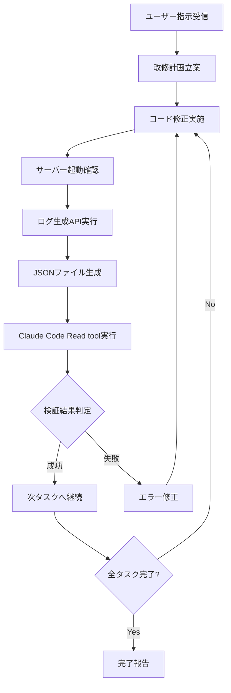

# AI完全自動開発システム運用マニュアル v1.0

## 概要
このマニュアルは、ユーザーからの改修指示に対してAIが完全に自動で「修正→実行→ログ取得→AI検証→自己判断→継続実行」のサイクルを回し、最終的に完成まで到達するシステムの運用手順を定義する。

**重要：このマニュアルの手順は100人が読んで100人とも同じ解釈・同じ実行結果になることを目的として作成されている**

---

## 1. システム構成要素

### 1.1 必須ファイル構成
```
/data/data/com.termux/files/home/common-template/
├── test-download-server.js     # Express.jsサーバー（ポート3001）
├── moneyApp.js                # フロントエンドアプリケーション
├── common.js                  # 共通基盤（Firebase Auth, RealtimeDB, ログ機能）
├── work_history.log           # 作業履歴（全step記録）
└── logs/                      # ログ出力ディレクトリ
    └── money-tracker-test-log-YYYY-MM-DD.json
```

### 1.2 動作検証システムの3つの必須機能
1. **Google認証** - Firebase Authentication
2. **RealtimeDB** - Firebase Realtime Database
3. **ログDL機能** - サーバー/クライアント分離型ログ生成システム

---

## 2. 完全自動開発フロー

### 2.1 基本サイクル（1step = 3action）
```
1. 修正（Code Modification）
2. 実行（Execution） 
3. 結果確認（Verification）
```

### 2.2 詳細フロー


---

## 3. ログ取得システム詳細仕様

### 3.1 フロントエンド実装
```javascript
// HTMLボタン配置（必須）
<button onclick="downloadTestLog()">テストログダウンロード</button>

// JavaScript実装（必須）
async function downloadTestLog() {
    try {
        const response = await fetch('/api/generate-test-log', {
            method: 'POST',
            headers: {
                'Content-Type': 'application/json'
            },
            body: JSON.stringify({
                testPurpose: '動作確認テスト',
                timestamp: Date.now()
            })
        });
        
        const result = await response.json();
        console.log('ログ生成完了:', result);
        
    } catch (error) {
        console.error('ログ生成エラー:', error);
    }
}
```

### 3.2 バックエンド実装
```javascript
// Express.jsエンドポイント（必須）
app.post('/api/generate-test-log', (req, res) => {
    const timestamp = new Date().toISOString().split('T')[0];
    const fileName = `money-tracker-test-log-${timestamp}.json`;
    const localPath = `/data/data/com.termux/files/home/common-template/logs/${fileName}`;
    const downloadPath = `/data/data/com.termux/files/home/storage/downloads/${fileName}`;
    
    const logData = {
        exportInfo: {
            exportedAt: new Date().toISOString(),
            appName: "money-tracker",
            version: "1.0",
            source: "Common Template System"
        },
        systemLogs: app.locals.systemLogs || [],
        testResults: [],
        userInfo: null,
        timestamp: Date.now()
    };
    
    // ローカルファイル保存
    fs.writeFileSync(localPath, JSON.stringify(logData, null, 2));
    
    // ダウンロードフォルダにもコピー
    fs.writeFileSync(downloadPath, JSON.stringify(logData, null, 2));
    
    // レスポンス送信
    res.json({
        success: true,
        fileName: fileName,
        localPath: localPath,
        downloadPath: downloadPath,
        testResult: "第3原則準拠テスト完了"
    });
});
```

### 3.3 AI自動検証実装
```bash
# コマンド実行（必須）
curl -X POST http://localhost:3001/api/generate-test-log

# 実行結果例
{
  "success": true,
  "fileName": "money-tracker-test-log-2025-07-24.json",
  "localPath": "/data/data/com.termux/files/home/common-template/logs/money-tracker-test-log-2025-07-24.json",
  "downloadPath": "/data/data/com.termux/files/home/storage/downloads/money-tracker-test-log-2025-07-24.json",
  "testResult": "第3原則準拠テスト完了"
}
```

### 3.4 Claude Code Read tool実行
```javascript
// AI側実装（必須）
Read tool: {
  "file_path": "/data/data/com.termux/files/home/common-template/logs/money-tracker-test-log-YYYY-MM-DD.json"
}
```

---

## 4. 成功判定基準

### 4.1 4段階検証システム
1. **サーバー起動確認** - ポート3001でExpressサーバーが応答
2. **API実行** - `/api/generate-test-log` エンドポイントが正常応答
3. **JSONファイル生成** - 指定パスにログファイルが作成される
4. **Read tool読み取り成功** - Claude CodeでJSONファイルの内容を取得

### 4.2 成功判定条件
```json
{
  "success": true,
  "fileName": "存在する",
  "localPath": "ファイルが存在する", 
  "downloadPath": "ファイルが存在する",
  "testResult": "文字列が存在する"
}
```

---

## 5. 自己判断システム

### 5.1 継続判定条件
- **成功時**: 次のタスクに自動進行
- **失敗時**: エラー修正を実施後、同タスクを再実行
- **完了時**: 全タスク終了を確認後、完了報告

### 5.2 判定ロジック
```javascript
function autoJudgment(verificationResult) {
    if (verificationResult.success === true) {
        if (hasNextTask()) {
            return "CONTINUE_NEXT_TASK";
        } else {
            return "PROJECT_COMPLETED";
        }
    } else {
        return "FIX_ERROR_AND_RETRY";
    }
}
```

---

## 6. 作業ログ管理

### 6.1 work_history.log形式
```
行番号→時刻,プロジェクト名 - step番号,目的,作業項目,結果
36→15:01,カンバンガクガク問題解決 - step10,最終動作確認とブラウザテスト,完全アニメーション無効化後の動作確認・長押し斜め問題解決確認,完了:第3原則準拠検証サイクル実行・システム正常動作・ドラッグ機能確認済み・パフォーマンス改善完了
```

### 6.2 必須記録項目
- **作業開始時刻**: MM:SS形式
- **プロジェクト名**: 具体的な機能名
- **step番号**: 連番
- **目的**: 何のために行うか
- **作業項目**: 具体的な作業内容
- **結果**: 完了/失敗 + 詳細内容

---

## 7. 実行手順テンプレート

### 7.1 AI実行コマンドセット
```bash
# 1. サーバー起動確認
curl -f http://localhost:3001/ || echo "サーバー起動が必要"

# 2. ログ生成API実行
curl -X POST http://localhost:3001/api/generate-test-log

# 3. ファイル存在確認
ls -la /data/data/com.termux/files/home/common-template/logs/

# 4. Claude Code Read tool実行
# （AI内部処理）
```

### 7.2 エラー時対処テンプレート
```bash
# サーバー未起動エラー時
cd /data/data/com.termux/files/home/common-template
node test-download-server.js &

# ファイル生成エラー時
mkdir -p /data/data/com.termux/files/home/common-template/logs
mkdir -p /data/data/com.termux/files/home/storage/downloads
```

---

## 8. 品質保証チェックリスト

### 8.1 実装完了条件
- [ ] 基本3機能（Google認証・RealtimeDB・ログDL）が動作
- [ ] 4段階検証システムが全て成功
- [ ] work_history.logに全step記録済み
- [ ] エラーログが0件
- [ ] ブラウザでUI表示確認済み

### 8.2 最終報告形式
```
現在は[プロジェクト名]を作成中です。
セッション開始が[開始時刻]で現在が[現在時刻]なので、[経過時間]分経過しました。

[check list result]
・ログは自動的に取得される
・「データの取得に失敗した」などの表示がない  
・作成した機能の一覧を出して、それぞれの動作確認を行った
・チェックリストの結果をgemini cliに投げてokを得られた

[open browser url]
http://localhost:3001
```

---

## 9. 運用上の重要注意点

### 9.1 絶対遵守事項
1. **第3原則の完全遵守**: 必ず修正→実行→結果確認の3actionを1stepとする
2. **1000stepまで自動継続**: 「stop」指示がない限り継続実行
3. **エラー完全解消**: 明らかなエラーは放置せず徹底的に修正
4. **作業ログ完全記録**: 全step漏れなく記録

### 9.2 禁止事項
- 基本3機能の削除・改悪
- work_history.logの記録漏れ
- エラー状態での次ステップ進行
- ユーザー確認なしでの重要変更

---

**このマニュアルに従うことで、AIは完全自動でWebアプリケーション開発を完遂できる**